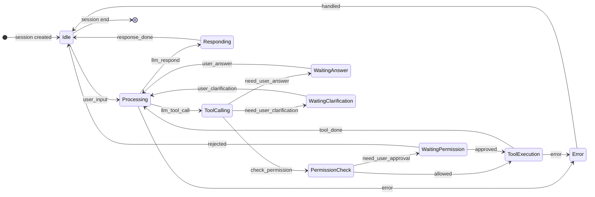
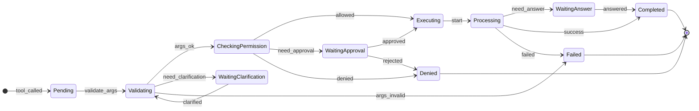

# 变更规范：AIAgent 使用 depa-actor Fiber Orchestration 完成调度改造（Stage 1→2→3）

## 概述

本 Track 将当前 AIAgent 的命令式执行与调度方式（由终端/调用方直接 `await aiAgentLoopStreaming()` 推进）彻底改造为：

- 由 `vendor/depa-actor` 的 fiber orchestration（`createOrchestratorState`/`reduceOrchestrator`/`scheduleOne`/`dispatchEffects`）驱动“下一步运行哪个 actor/fiber”。
- 将“推进/暂停/恢复/公平性/超时重试”等调度语义集中在 orchestrator 中表达与测试。

迁移分为三个阶段，严格按 Stage 1 → Stage 2 → Stage 3 顺序完成。

约束：
- 本 Track 为 **BREAKING**：不保留 legacy 调度入口作为长期兼容层（允许 Stage 1 内部存在 Bridge 过渡实现，但最终必须移除 legacy 路径）。
- Questionnaire 的 `suspendPolicy` 必须继续支持 `pause_all` 与 `continue_others`。
- 现阶段通过 Questionnaire 仅覆盖 WaitingAnswer（用户回答），WaitingPermission/WaitingClarification 作为未来能力预留，本 Track 不要求新增这些交互能力。
- SubAgent 未来同时支持“同步等待”和“后台运行”两种模式；两种模式都必须在 subagent 完成时向 parent actor 发送完成消息，并由 parent 按 mailbox 优先级处理并将结果注入对话历史。

## ADDED Requirements

### Requirement: Fiber orchestration 成为唯一调度权威
系统 MUST 使用 depa-actor fiber orchestration 决定“下一个运行的 actor/fiber”，而不是由外部调用方循环直接推进。

#### Scenario: 调度权从调用方转移到 orchestrator
- **GIVEN** 当前存在 main actor 与多个 sub actor
- **WHEN** 系统需要推进执行
- **THEN** 系统通过 `scheduleOne()` 选择下一条 fiber
- **AND** 通过 `dispatchEffects()` 将本次 step 投递到目标 actor
- **AND** 调用方不再直接调用 `aiAgentLoopStreaming()` 作为推进手段

### Requirement: Stage 1 — Orchestrator 驱动 + Bridge 过渡 + Hard replace 调用点
系统 MUST 在 Stage 1 完成以下内容：

- 新增 AIAgent orchestrator 驱动（OrchestratorState + reduce + schedule + dispatchEffects）。
- 允许在 Stage 1 内引入 Bridge：一个 fiber step 仍可调用一次现有 `aiAgentLoopStreaming()`，以降低首次迁移风险。
- Hard replace：将所有运行路径中直接调用 `aiAgentLoopStreaming()` 的调用点迁移为“发送输入 + tick orchestrator”的方式。
- **BREAKING**：移除 AIAgent actor mailbox schema 中的 `cancel` tag，所有取消信号改为通过 `control` tag（例如 `control.kind=cancel_requested`）表达，并保证其优先级不低于迁移前的 `cancel`。

并且，Stage 1 MUST 完成对 `QuestionnaireRequest.suspendPolicy` 的语义对齐：支持同一 orchestrator 内不同 waiting fiber 采用不同的人类等待策略（per-fiber/per-wait policy），而不是仅能依赖全局单一策略。

#### Scenario: Terminal minimal 不再直接调用 aiAgentLoopStreaming
- **GIVEN** 用户启动 terminal minimal
- **WHEN** 用户输入一条消息
- **THEN** minimal 将输入投递到 actor mailbox
- **AND** 触发 orchestrator tick 推进
- **AND** 不直接调用 `aiAgentLoopStreaming()`

#### Scenario: Questionnaire 等待与恢复由 orchestrator 控制
- **GIVEN** 某 actor 发出 `QuestionnaireRequest(suspendPolicy=pause_all)` 并进入等待
- **WHEN** orchestrator 调度下一步
- **THEN** 进入 pause_all 门控：所有 fiber 暂停推进
- **AND** 当用户回答到达并恢复等待 fiber 后，调度恢复

#### Scenario: continue_others 不阻塞其他 actor
- **GIVEN** 某 actor 发出 `QuestionnaireRequest(suspendPolicy=continue_others)` 并进入等待
- **WHEN** orchestrator 调度下一步
- **THEN** 其他 ready fiber 仍可被选择并推进

### Requirement: Stage 2 — SubAgent Fiber 化 + 完成消息回注历史
系统 MUST 在 Stage 2 完成以下内容：

- SubAgent 作为 child fiber 运行，建立 parent/child fiber 关系。
- 支持两种 subagent 模式：
  - `sync_wait`：parent 在子流程完成前挂起（等待 orchestrator waitingReason=child_done，对应 parent 的 `childDone` mailbox tag 消息），完成后将结果作为 tool result / 对话历史输入，继续主流程。
  - `background`：parent 不因 subagent 挂起而停止推进；subagent 完成时仍必须向 parent 发送完成消息；parent 在处理完成消息时，将结果注入对话历史（用于后续上下文）。
- 无论哪种模式，subagent 完成后 MUST 向 parent actor 发送一个“完成消息”，且该消息 MUST 具有足够高的 mailbox 优先级，确保能在下一次调度 step 中优先处理。

#### Scenario: sync_wait — 子代理完成后恢复父流程并注入 tool 结果
- **GIVEN** parent actor 触发 RunSubAgent 且 mode=sync_wait
- **WHEN** child fiber 完成
- **THEN** child 发送完成消息到 parent
- **AND** parent 优先处理完成消息
- **AND** parent 将子结果注入到对话历史（messages 中出现可回放的条目）
- **AND** parent 流程继续推进

#### Scenario: background — 父流程继续推进但仍接收子结果回注
- **GIVEN** parent actor 触发 RunSubAgent 且 mode=background
- **WHEN** child fiber 完成
- **THEN** child 发送完成消息到 parent
- **AND** parent 优先处理完成消息
- **AND** parent 将子结果注入到对话历史（供后续轮次使用）

### Requirement: Stage 3 — 将执行器拆为 cooperative step state machine
系统 MUST 在 Stage 3 完成以下内容：

- 将当前命令式 `aiAgentLoopStreaming()` 的“长量子”执行方式拆为 cooperative step 状态机：
  - 每个 fiber step 执行一个可界定的量子（例如：一次 mailbox drain、一次 LLM turn、一次 tool 执行、一次等待决策）。
  - 在外部等待（LLM/tool/human）阶段使用 `suspend`/`resume` 表达，并将调度权交回 orchestrator。
- 支持在一个 actor 等待外部 IO 时调度其他 actor（充分利用 continue_others 与公平性）。

并且，该 cooperative state machine MUST 与以下两类业务状态机语义对齐（名称可相同或等价映射）：

1) **会话处理状态机**

2) **工具执行状态机**

#### Scenario: LLM 调用等待期间调度其他 fiber
- **GIVEN** fiber A 在一次 LLM 调用期间进入等待状态
- **AND** 存在其他 ready fiber
- **WHEN** orchestrator 调度下一步
- **THEN** 其他 fiber 可继续推进

#### Scenario: WaitingPermission/WaitingAnswer/WaitingClarification 以 suspend/resume 表达
本 Track 的验收仅要求 WaitingAnswer 链路（human_answer）可用；WaitingPermission/WaitingClarification 仅作为状态机语义对齐的预留，不要求可被真实触发。

- **GIVEN** 当前 fiber 进入 WaitingAnswer
- **WHEN** cooperative step 状态机进入等待阶段
- **THEN** fiber MUST 进入 `suspended`
- **AND** `waitingReason` 映射为 `human_answer`
- **AND** 在收到用户回答后，fiber MUST 通过 `resume` 回到可调度状态并继续 Processing

## 非功能需求

### Requirement: 可测试性与确定性
系统 MUST 为 orchestrator 驱动调度提供可重复、可断言的测试：

- fairness/aging（避免饥饿）
- pause_all/continue_others
- subagent parent/child 链路
- questionnaire 等待/恢复

#### Scenario: 相同输入序列得到一致调度轨迹
- **GIVEN** 固定的 now 时间序列与相同输入消息
- **WHEN** 重复执行测试
- **THEN** 可得到一致的可断言结果

### Requirement: 事件流与终端展示稳定
系统 SHALL 保持 BizEvent/TUI 展示的可用性，不因调度改造破坏交互链路。

#### Scenario: 终端回归测试通过
- **GIVEN** 现有 terminal tui 的 stream/tui fixtures
- **WHEN** 完成 Stage 1→3 改造
- **THEN** 关键回归测试保持通过或按规范更新

## 验收标准

- 所有执行推进由 orchestrator 驱动；调用方不再直接调用 `aiAgentLoopStreaming()`。
- Questionnaire 的 `pause_all/continue_others` 在多 actor 场景可通过集成测试验证。
- SubAgent 同时支持 `sync_wait` 与 `background` 两种模式，且完成消息按 mailbox 优先级被 parent 处理并注入对话历史。
- Stage 3 完成后，执行器具备 cooperative step 能力，等待外部 IO 时可调度其他 fiber。

## 范围外事项

- 不新增新的 UI/交互形态（只改内部调度/执行模型）。
- 不在本 Track 内重新设计 Questionnaire schema（沿用既有结构）。
- **GIVEN** fiber A 进入 WaitingAnswer 且 suspendPolicy=pause_all
- **AND** fiber B 进入 WaitingAnswer 且 suspendPolicy=continue_others
- **WHEN** orchestrator 调度下一步
- **THEN** `pause_all` 的等待应当阻塞整个 orchestrator 调度
- **AND** 当 pause_all 的等待 fiber 恢复后，`continue_others` 等待不应阻塞其他 ready fiber

### Requirement: depa-actor orchestration 支持 per-fiber human suspend policy
系统 MUST 扩展 `vendor/depa-actor` orchestration，使 human wait gating 可按 fiber（或按一次 suspend 动作）携带策略（pause_all/continue_others），并在 scheduler 中生效。

#### Scenario: scheduler 仅在存在 pause_all human-wait fiber 时全局暂停
- **GIVEN** orchestrator 中存在多个 suspended fiber，waitingReason 为 human_*，且仅部分 fiber 标记为 pause_all
- **WHEN** 调用 `selectNextFiberId()`
- **THEN** 当且仅当存在 pause_all 的 human-wait fiber 时返回 undefined
- **AND** 仅有 continue_others 的 human-wait fiber 时，ready fiber 仍可被调度
