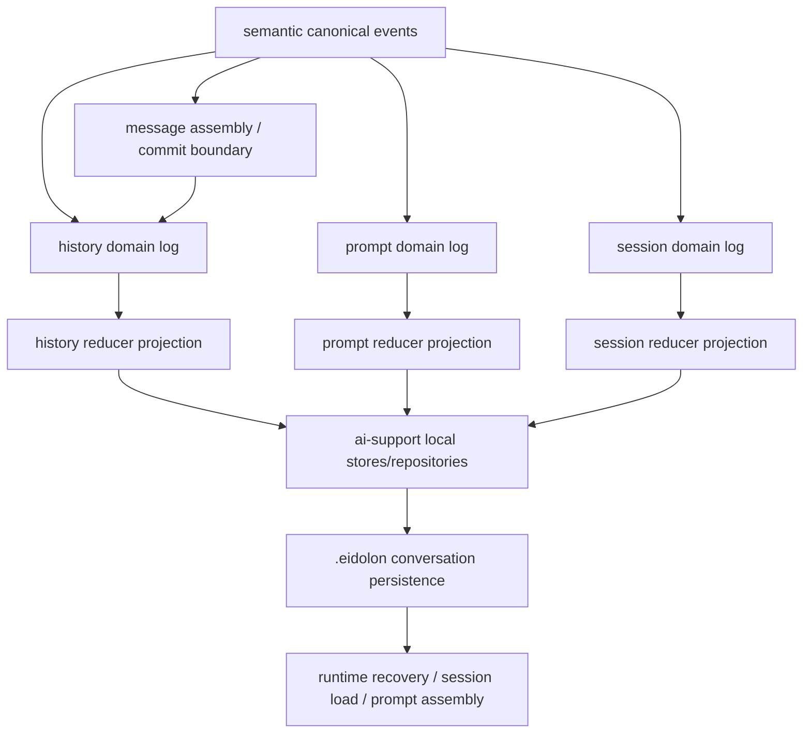

# 设计：AIAgent `.eidolon` Conversation Domain Persistence

## 上下文

本项目已经具备三类关键基础：

1. `semantic-first` 的 canonical event 主链
2. `depa-data-graph` 的 ordered timeline / append-only event log / reducer projection foundation
3. `.eidolon/sessions/<session>/` 下现成的本地 transcript、runtime snapshot 与 session load 机制

因此，这次不是从零设计 persistence，而是要把现有零散能力提升为统一的 conversation domain。

同时必须遵守已完成的 package topology 拆分：

- `@cell/ai-support`
  - local/server support 实现与 support bundle factory 的正式宿主
- `@cell/ai-organ-contract`
  - AI-specific persistence contract 的正式宿主
- `@cell/ai-organ-logic`
  - persistence orchestration / runtime recovery 的正式宿主

所以，这次 track 中的 `.eidolon` 本地读写实现不能再放在 runtime entry 或 `ai-organ-logic`，而应作为 `ai-support` 的 support backend side effects 实现。

当前主要偏差：

- `messages` / transcript / compaction summary 混在一起，history truth 与 prompt truth 没有正式边界
- 压缩逻辑通过 summary + ack 改写当前 messages，但没有独立 prompt head
- 历史 session 加载可用，但没有从 history head / prompt head / session index 恢复
- transcript、runtime snapshot、orchestration log 都在记录“跟对话有关的东西”，但谁是正式真相并不清楚

## 设计翻译规则

参考设计中的 “conversation domain stream family” 在本项目中翻译为：

- 概念层：
  - history domain
  - prompt domain
  - session domain
- 物理层：
  - `depa-data-graph` append-only event log
  - reducer projection / signal
  - actor-owned runtime state

换言之：

- 不复刻 Rx / stream object 实现
- 不引入 Python `reaktiv`
- 直接落到本项目已经标准化的 DataGraph + Actor 模型

## 总体分层



解释：

- `semantic canonical events`
  - 仍是最底层正式事实流
- `message assembly / commit boundary`
  - 负责把 delta 聚合为完整消息
  - 但不直接成为最终 history truth
- `conversation domain logs`
  - history / prompt / session 三域正式事件
- `reducer projections`
  - 生成 raw domain state
- `ai-support local stores/repositories`
  - `.eidolon` 本地文件副作用实现
  - path layout / serializer / repository factory / store
- `.eidolon conversation persistence`
  - 第一版正式权威持久化落点
- `runtime recovery / session load / prompt assembly`
  - 统一从 conversation heads 与 generation persistence 恢复

## 三域模型

### 1. History Domain

职责：

- 表达真实提交过的 message history
- 管理 compaction 后的 predecessor / active tail
- 为历史 session 加载提供正式 history head

核心对象：

- `ActorHistoryGenerationData`
- `ActorHistoryHeadData`
- `ActorHistoryLineageData`
- `ActorCommittedMessageRef`

核心事件：

- `actor_history_generation_created`
- `actor_history_appended`
- `actor_history_generation_sealed`
- `actor_history_head_moved`
- `actor_history_compaction_applied`

关键点：

- actor transcript 仍保留，但成为原始消息证据
- 正式可恢复历史以 generation/head/lineage 为准

### 2. Prompt Domain

职责：

- 表达当前发给模型看的上下文
- 正式吸收 compaction summary
- 为未来 micro compact / context asset 预留 transform chain

核心对象：

- `ActorPromptGenerationData`
- `ActorPromptBasisData`
- `ActorPromptTransformData`
- `ActorPromptHeadData`

核心事件：

- `actor_prompt_generation_created`
- `actor_prompt_basis_selected`
- `actor_prompt_transform_applied`
- `actor_prompt_head_moved`
- `actor_prompt_reset`

第一版必须做的不是“所有 prompt 技巧”，而是把现有 compaction summary 从伪历史迁移为 prompt truth。

### 3. Session Domain

职责：

- 表达 `.eidolon` 本地 session 的 conversation-level metadata
- 管理 active actor / history head / prompt head
- 为未来 branch / fork / asset registry 保留入口

核心对象：

- `LocalConversationSessionData`
- `LocalConversationSessionHeadData`
- `LocalConversationSessionLineageData`
- `LocalConversationContextAssetData`（可延后实现）

核心事件：

- `local_conversation_session_created`
- `local_conversation_session_head_selected`
- `local_conversation_session_loaded`
- `local_conversation_session_compaction_committed`
- `local_conversation_session_lineage_updated`

## `.eidolon` 第一版权威布局

第一版 conversation persistence 固定在：

```text
.eidolon/
  sessions/
    <session>/
      actors/
        <actor-dir>/
          transcript.txt
          actor.json
          state.json
          mailboxes.json
      runtime_state/
        ...
      logs/
        orchestration_history.txt
      conversation/
        history.index.json
        prompt.index.json
        session.index.json
        artifact-refs.index.json
        history-generations/
          <generation-id>.json
        prompt-generations/
          <prompt-generation-id>.json
```

职责冻结为：

- `actors/*/transcript.txt`
  - append-only 原始消息证据
  - transcript reducer 输入
  - migration/bootstrap 输入
- `runtime_state/*`
  - actor/vm/fiber durable snapshot
  - 非 conversation truth
- `logs/orchestration_history.txt`
  - 审计与调试
  - 非 conversation truth
- `conversation/history.index.json`
  - history head
  - generation manifest
  - predecessor / active tail 元数据
- `conversation/prompt.index.json`
  - prompt head
  - basis refs
  - transform chain
- `conversation/session.index.json`
  - session-level conversation metadata
  - active actor / active heads
  - lineage slot
- `conversation/artifact-refs.index.json`
  - compaction artifact / diagnostics refs
  - 非 history truth

## Package Ownership

本 track 的 ownership 按已归档 topology 固定为：

- `@cell/ai-organ-contract`
  - conversation domain data
  - history / prompt / session persistence contract
  - repository/store interface contract
- `@cell/ai-organ-logic`
  - domain reducer / orchestration
  - compaction orchestration
  - runtime recovery / session load 接线
- `@cell/ai-support`
  - `.eidolon` local path layout
  - local JSON store / transcript-adapter bridge / repository factory
  - 本地 serializer、materializer、migration bootstrap side effects

这保证：

- organ 层继续拥有领域契约和 orchestration
- support 层拥有本地副作用实现
- 不再出现 runtime entry 或 mod 层正式拥有 `LocalFile*` conversation backend 的情况

更细的文件级迁移清单见 [file-level-migration-map.md](./file-level-migration-map.md)。

## Compaction 的新语义

当前实现中，`ContextCompressor` 会产出 `state_snapshot` XML，并把：

- summary 作为 `user` message
- ack 作为 `assistant` message

直接注入当前 `messages`

这会把“用于后续 prompt 的 compacted context”和“真实历史消息”混为一谈。新设计要求拆开：

1. history 域：
   - seal 被压缩前的 predecessor generation
   - 建立新的 active generation
   - move history head
2. prompt 域：
   - 记录 compacted summary 作为 prompt basis 或 transform
   - move prompt head
3. artifact refs：
   - 如需保留 summary 源证据或压缩过程产物，独立写入 artifact refs

兼容迁移策略：

- 第一阶段允许保留旧 summary + ack 的可见兼容路径
- 但 contract 上必须把它降级为兼容投影，而不是正式 history truth

## 历史 Session 加载与恢复顺序

迁移后的恢复顺序：

1. 读取 `conversation/session.index.json`
2. 解析 active actor、history head、prompt head
3. 从 `history-generations/*` 恢复可见历史结构
4. 从 `prompt-generations/*` 恢复当前 prompt context
5. 需要兼容或审计时，再读取：
   - `actors/*/transcript.txt`
   - `runtime_state/*`
   - `logs/orchestration_history.txt`

这样可以保证：

- 历史 session 加载优先恢复 conversation truth
- transcript / snapshot 退回为辅助数据源

## TUI `/resume` 会话查看与恢复

本项目 TUI 不需要重新发明一套 session picker，而是要把现有 session surface 正式接到 conversation-first 恢复链路上。

交互要求固定为：

1. 用户在 composer 输入 `/resume`、`/continue` 或 `/session`
2. 按 Enter 后直接打开现有 `SessionList` surface
3. surface 提供可滚动的 session 列表，支持上下移动当前选择
4. 用户按 Enter 后切换到目标 session
5. 进入目标 session 后，历史消息优先通过 runtime-first conversation views 恢复；只有 runtime 无法提供 raw state/views 时才回退 `.eidolon` persistence loader

实现约束：

- 如果当前仍在 home 且尚未创建 session，输入 `/resume` 时不得先隐式创建空 session
- `/resume` 触发的是 TUI 内建 UI command，而不是一次发往 runtime agent 的普通 slash turn
- TUI session list 的展示、滚动、上下选择和 Enter 恢复继续复用现有 dialog 能力，本次 track 主要补齐 slash routing 与恢复后的 conversation-first hydration
- session list 的每个条目改为三行摘要：
  - 第一行显示 create / update 时间
  - 第二行显示初始用户问题
  - 第三行显示最新消息预览，并对超长文本做省略
- persisted session list info 不得再用“当前时间”伪造 create / update；应优先从 `.eidolon` conversation/session persistence 与 history view 推导真实摘要

## 与当前代码的接入点

第一版主要接入点：

- `MessageHistoryGraph`
  - committed message -> history domain event
- `LocalFileActorTranscriptStore`
  - 继续承担 transcript evidence 读写
- `ai-support` 新增或收口的 local stores/repositories
  - conversation index store
  - generation repository
  - bootstrap / migration helpers
- `ContextCompressor`
  - 输出 summary 给 prompt domain，而不是直接充当唯一 history
- `RuntimeSnapshots`
  - recovery/load 改为优先从 conversation persistence 读取 heads/generations
- TUI / headless session load
  - 读取 `.eidolon/sessions/<session>/conversation/*`

## 当前相对参考设计的剩余偏差

截至本 track 当前分支，已经完成的部分主要是：

- contract 下沉
- `.eidolon` conversation persistence 目录与 repository
- compaction 的 prompt persistence 首版
- recovery / TUI 的 conversation-first read path

但相对参考设计，仍有四类剩余偏差需要修正：

1. `conversation domain stream family` 还没有成为正式 runtime 主链
   - 当前 reducer/projection helper 已存在，但还没有稳定地进入 compaction / recovery / load 的正式 orchestration
2. prompt truth 还没有进入 runtime consumption 主链
   - 当前 prompt generation 已持久化，但 recovery 与模型输入恢复仍主要回填 `actor.messages`
3. full compaction 仍保留“summary + ack 混入 formal history”的偏差
   - 当前需要把 summary 彻底降回 prompt truth 与 artifact refs
4. history generation payload 仍偏 transcript-style replay，而不是 committed-message DTO
   - 这会让 runtime / TUI 继续依赖 transcript reducer 反向组装消息

因此，本次 track 需要追加一个“偏差修正阶段”，继续把结构对齐推进到主链数据流对齐。

## P6 修正策略

### 1. 先修 compaction truth split

优先把 full compaction 的 formal history / prompt split 修正到位：

- active history generation 只保留真实 active tail committed messages
- `state_snapshot` summary 仅存在于 prompt generation materialized context / transform
- compatibility ack 不再进入 formal history

这是后续 recovery 与 prompt view 修正的前提。

### 2. 再拆 runtime prompt view 与 visible history view

新增两个正式 loader：

- runtime prompt view
  - prompt head + active history tail
  - 用于恢复 `actor.messages` 与后续模型输入
- visible history view
  - sealed predecessors + active tail
  - 用于 TUI/headless 历史浏览

这样可以避免“一个 `actor.messages` 同时充当 prompt truth 和 history truth”的混用。

### 3. 最后升级 history generation payload

history generation 的 persisted payload 需要从 transcript-style stream record 升级为 committed-message DTO：

- committed role
- content
- reasoning content
- tool calls / tool result attribution
- message-level `startAt` / `endAt`

旧 generation 允许继续用 transcript-style fallback 读取，但新写入路径应优先写 committed message DTO。

### 4. projection 进入正式 orchestration

本轮不强求一步到位重建完整 `depa-data-graph` 多流 runtime，但至少要满足：

- compaction / recovery / load 的正式路径不再完全手工拼写 heads / lineages / bindings
- conversation projection helper 被主链调用，用于统一派生下一版 raw state / snapshot

这样可以让后续真正切到 domain stream family 时，已有 reducer/projection 不会继续停留在测试层。

### 5. 当前落地结果

P6 修正后，本分支已经把关键偏差收口到以下状态：

- full compaction 不再把 `state_snapshot + ack` 写入 formal history generation
- compaction 后的 transcript 只保留原始证据，不再追加压缩后的伪历史消息
- recovery 使用 `prompt head + active tail` 恢复 runtime prompt view
- TUI / headless 历史浏览使用 predecessor + active tail 的 visible history view
- history generation 新写入统一保存 committed-message DTO，并保留 transcript-style fallback
- `ai-organ-logic` 在 compaction orchestration 中使用 conversation projection reducer 重放增量事件，再回写新的 history/prompt/session indexes

## P7 修正策略

P6 之后剩余的主要偏差不再是 persistence 结构，而是“同一份原始状态如何被多个消费面统一读取”。

### 1. 引入 conversation raw state 读取层

在 `ai-support` 中增加一层正式 raw state loader：

- 一次性读取 history / prompt / session indexes
- 解析 active actor binding、history head、prompt head
- 物化 visible history generations、active history generation、active prompt generation

随后：

- runtime prompt view
- visible history view
- session metadata / active actor view

都从这份 raw state 派生，而不是继续各自独立读取 persistence。

### 2. 为 prompt 域补通用 transform interpreter

当前 runtime prompt view 只正式识别 `history_compaction_summary`，这会导致 prompt 域仍然偏特例化。

P7 中应将 prompt prelude/materialization 抽象为独立解释步骤，至少统一处理：

- `history_compaction_summary`
- `micro_compact`
- `context_asset_attach`
- `context_asset_extract_text`
- `context_asset_select_fragment`
- `context_asset_bind_summary`
- `overlay`

注意：

- 本轮不要求把所有 asset transform 都接成完整宿主机制
- 但要求建立稳定的解释入口与 fallback 规则

### 3. 补最小 session raw state 消费面

session 域当前已有 contract 与 index，但消费面仍比较散。

P7 中至少要求：

- TUI / headless 解析 active actor 时优先读取 session raw state
- debug / loader / runtime helper 不再重复手写 active actor + actor binding 推断逻辑

这样 session domain 才不只是一个 persistence slot，而开始成为统一读取入口。

## P8 修正策略

P7 之后，和参考实现相比还剩下最后一层偏差：

- conversation runtime 虽然已有容器，但恢复链路还没有把 persisted raw state 注入进去
- semantic/message assembly 主链还没有稳定把 live committed history 推进 runtime domain
- compaction 已经会写 persistence，但还没有把领域事件和 runtime raw state 同步成同一条主链
- session raw state 的结构已经扩张，但 runtime signal 还没有完整承接 selection / asset / prompt basis 等事件语义

因此 P8 的目标不是再改 `.eidolon` 布局，而是让当前实现真正从“repository-centered helper set”收口到“runtime conversation domain + persistence backplane”。

### 1. recovery 把 persisted raw state 注入 conversation domain runtime

`recoverAiAgentRuntime(...)` 在 hydrate VM 之后，需要：

- 创建或取得 `ConversationDomainRuntime`
- 读取 persisted session raw state
- 逐 actor 读取 persisted actor raw state
- 把这些 raw state 注入 runtime 的 session/history/prompt/actor signals

这样恢复后的 runtime 才会和参考实现一样，拥有常驻的 conversation raw state 真相，而不是每次消费时重新从 repository 临时读取。

### 2. live history append 进入 runtime domain 主链

`MessageHistoryGraph` 仍是 semantic -> committed message 的 assembly 边界，但 P8 要求它不只写 transcript / conversation persistence，还必须：

- 把 transcript record batch 继续 reducer 成完整 message
- 将新增 committed messages append 到 `ConversationDomainRuntime`
- 让 runtime history signal 与 actor raw state 在会话进行中持续前进

这样 session 内的 prompt/history 消费面才能真正拥有 live runtime truth，而不是只在 reload 后才对齐。

### 3. compaction 同步领域事件与 runtime raw state

`applyConversationCompaction(...)` 完成 `.eidolon` 写入后，主执行器需要继续：

- append history/prompt/session 领域事件到 `ConversationDomainRuntime`
- 标记 history sealed/head move/compaction metadata
- 标记 prompt generation/basis/transform/head move
- 再从 persistence 反向同步最新 actor raw state，保证 runtime view 与本地真相一致

这样 compaction 就不再只是“写文件成功”，而是正式成为 conversation domain 自身的一次状态演进。

### 4. session raw state 补齐为运行时统一入口

P8 要求 `ConversationSessionRawState` 正式包含：

- `contextAssets`
- `activeSelection`

并要求 runtime session signal 能随 domain event 更新这些槽位。这样后续 branch / asset / selection 机制虽然还未全部实现，但运行时本体已经具备正式挂载点。

### 5. P8 落地结果

P8 完成后，本分支相对参考设计的剩余差距会收口到“更高级的 prompt runtime ops 与未来 asset/micro-compact 宿主机制”，而不再是主链事实流偏差：

- recovery 会把 persisted session/actor raw state 注入 runtime conversation domain
- live semantic/message assembly 会持续推进 runtime history truth
- compaction 会同时产出 persistence truth 与 runtime domain events
- session raw state 会成为 selection / binding / asset 的正式运行时入口
- 当前 runtime prompt/history views 不再依赖 reload 之后才重新对齐

## P9 修正策略

P8 之后剩余偏差已经缩小到 runtime 本体层。P9 的目标不是继续扩展 `.eidolon`，而是把当前的 conversation runtime 从“可用容器”推进为“正式 runtime family”。

### 1. runtime stream family API 正式化

P9 要求 `ConversationDomainRuntime` 不再只暴露：

- `historyEvents / promptEvents / sessionEvents`
- 若干 value signal

而要补上正式的运行时入口：

- history / prompt / session 的 subscribe API
- 对应的 tee stream API
- runtime-level persist hook

这样 conversation runtime 才能真正作为中层领域流族宿主，而不是只能被动读取数组和 signal。

### 2. message assembly state 进入 runtime 本体

P8 已经把 live ingress 接进了 runtime domain，但桥接仍然偏临时。

P9 需要在 conversation runtime 内补一份正式的 message assembly state：

- actor 级 transcript record batch
- reducer 后的完整 committed messages
- 已推进到 history domain 的 message 边界

这样 live ingress 的“中间层状态”会成为 runtime 本体的一部分，而不再是 attach 过程中的散落 Map。

### 3. prompt runtime ops 最小落地

P9 不追求一次性复刻参考实现全部 prompt runtime API，但要求补齐最核心的正式入口：

- prompt request
- prompt overlay
- context block register
- context block detach-all

这些 API 需要直接驱动 conversation domain runtime 的 prompt/session state，而不是只依赖 `.eidolon` persistence 回读后才体现效果。

### 4. session lifecycle 先补 runtime 入口

session 域的完整 fork/close 宿主机制仍可能分阶段接入，但 P9 至少要求：

- session lifecycle 语义进入 runtime 设计
- selection / binding / asset 继续作为正式 session runtime state 的一部分
- 对 fork / close 保留正式事件与 runtime 扩展入口

### 5. P9 的验收口径

P9 完成后，当前实现相对参考设计的剩余差距应主要收敛为：

- 事件对象仍不如参考实现那样厚
- 上层 UI/TUI/Web 消费面尚未全部改为 runtime-first
- 更完整的 prompt/session orchestration 仍可继续扩展

但不应再停留在：

- 没有 stream family API
- 没有正式 message assembly state
- 没有 prompt runtime ops

## P10 修正策略

P9 之后，剩余偏差主要集中在两个方向：

- 事件对象虽然已经开始变厚，但主链里仍有不少薄事件
- 上层消费面虽然已经能使用 runtime truth，但还没有形成“runtime-first, persistence-fallback”默认策略

### 1. 让厚事件成为主链首选

P10 不要求所有事件一步到位都复制参考实现的 trace/team 包装，但要求：

- 主链产生的 history event 优先携带 generation/head/compaction object
- 主链产生的 prompt event 优先携带 generation/transform/head object
- 主链产生的 session event 优先携带 session/binding/selection/lineage object

这样 reducer 和 runtime state 更新时，会更多依赖事件自身，而不是现场推断。

### 2. 上层消费面改为 runtime-first

P10 对消费面的目标不是“完全移除 persistence loader”，而是：

- 当 runtime bridge 仍在线且 conversation runtime 有状态时，上层先读取 runtime raw state
- 只有在 runtime 不可用、session 已离线或没有对应状态时，才回退到 `.eidolon` repository-first loader

这尤其适用于：

- TUI 历史加载
- active actor 解析
- runtime prompt / visible history 读取

### 3. P10 验收口径

P10 完成后，本 track 的剩余偏差应主要收敛为：

- 还没有把所有消费者都切到 runtime-first
- 还没有把所有事件都做成参考实现那样的全量厚对象

但当前主链和主要上层消费面不应再继续默认：

- 用薄事件驱动大量 runtime 推断
- 在 runtime 可用时仍先走 persistence-first

## 延后项策略

以下能力允许先做定义、后做实现：

- rollback / fork runtime surface
- context asset registry 的扩展形态
- micro compact
- branch explain / UI surface

但它们不能继续保持“未命名隐式机制”状态，必须在 contract、event kind 和持久化槽位中预留清楚。

## 风险与权衡

### 风险 1：兼容迁移期间形成双真相
- 风险：
  - transcript/snapshot 与 conversation index 并存时，容易再次出现双真相
- 缓解：
  - 明确 conversation index 是正式恢复入口
  - transcript/snapshot 只做 bootstrap / audit / compatibility

### 风险 2：compaction cutover 破坏当前可见行为
- 风险：
  - 当前部分消费面可能默认 summary + ack 仍表现为 message
- 缓解：
  - 先保留兼容投影
  - 再逐步改为 prompt-domain-first 显示

### 风险 3：session load 仍从旧路径拼装
- 风险：
  - TUI 或 headless loader 继续各自读取 snapshot/transcript
- 缓解：
  - 增加 focused tests，锁定 history session load 必须优先读取 conversation heads

## P11 修正策略

P10 之后，本 track 相对参考设计还剩下 3 个核心差距。这些差距已经不再是 `.eidolon` persistence 或三域 contract 是否存在，而是 runtime-native 主链是否真正闭合。

### 1. 主要消费面还没有全面 runtime-first

当前实现已经具备：

- runtime raw state 注入
- VM/runtime bridge 读取 helper
- TUI 历史加载优先走 runtime view

但主要消费面仍然是 runtime-centered 与 repository-centered 并存：

- 一部分入口已经从 VM raw state / runtime views 读取
- 另一部分入口仍直接调用 repository-first loaders
- 离线列表、摘要、恢复辅助逻辑中仍有不少 persistence-first 分支

而参考设计要求的是：

- UI/TUI/Web/prompt assembler 都优先读取同一套 runtime raw state signal
- 只有 runtime 不可用、状态不存在或宿主已离线时，才回退到 persistence loader

因此 P11 要求把“runtime-first, persistence-fallback”从局部策略提升为主要消费面的默认入口。

### 2. 主链事件仍未完全达到参考实现的厚对象语义

当前 event contract 已比早期版本更厚，但仍存在不少：

- `id + optional object` 的薄事件
- reducer 现场补默认值
- runtime 现场从旧 state 推断前态/后态

参考设计的目标不是“事件里有些对象就够了”，而是：

- history event 尽量直接携带 generation / head / compaction object
- prompt event 尽量直接携带 generation / basis / transform / head object
- session event 尽量直接携带 session / binding / selection / lineage / asset object

这样 reducer 与 runtime raw state 更新可以优先依赖事件本身，而不是依赖外部状态和隐式推断。

因此 P11 要继续补厚主链事件，并把 reducer / runtime 的默认推断逻辑压缩到兼容 fallback 层。

### 3. live ingress 仍以 transcript reducer 为桥接器，而不是正式 message assembly state

当前 live committed history 已经能推进 runtime domain，但主链仍是：

- 累积 `TranscriptRecord`
- 调 `reduceTranscriptToMessages(...)`
- 通过长度差推断新增 committed messages

这与参考设计中的三层分工仍有偏差：

- semantic fact stream
- message assembly state
- conversation domain stream family

P11 的目标不是删除 transcript evidence，而是把 transcript reducer 从“live ingress 主桥接器”降级为：

- bootstrap / compatibility / audit helper

而让正式 message assembly state 成为：

- live committed message append 的唯一增量边界
- history domain event append 的正式上游
- runtime message provenance 的正式宿主

### P11 验收口径

P11 完成后，本 track 相对参考设计的核心偏差应收敛为仅剩延后项，而不再剩下主链层面的结构性差距：

- 主要消费面默认 runtime-first，只有离线/缺状态时才回退 persistence
- 主链 history/prompt/session 事件优先携带厚对象，reducer 不再普遍依赖现场推断
- live ingress 通过正式 message assembly state 推进 conversation domain，而不再依赖 transcript reducer + 长度差

P11 不要求本轮同时做完的延后项：

- rollback / fork 的完整 runtime surface
- context asset registry 的扩展形态
- micro compact 的完整宿主机制
- branch explain / diagnostic UI surface

### P11 当前收口进度

本轮已进一步收口的部分：

- provider / adapter 失败不再只表现为“空完成”，而会通过正式错误事件进入 TUI / headless 可见输出，并让 `exec` 返回失败态
- runtime conversation 的厚事件消费已补 focused test，确认 `actor_history_appended` 在携带 generation/head/message 对象时可直接驱动 runtime state，而不是依赖 fallback 推断
- live ingress 的主验证口径已切到 committed-message append；`updateConversationDomainFromTranscriptRecordBatch(...)` 明确降级为 bootstrap / compatibility helper，不再作为推荐主桥接入口

仍待继续收口的主项：

- 主要消费面尚未做到“默认 runtime-first, 仅在缺状态/离线时 persistence-fallback”的全面统一，尤其是部分 persisted session summary / offline listing 路径仍保留 repository-first 分支

补充说明：

- active / loaded session 的 `messages`、`get`、`fork`、TUI history hydrate 与 live session summary 已切到 runtime-first
- 未加载历史 session 的 list / summary 继续允许直接从 `.eidolon` 读取，这是 P11 口径内允许的离线 fallback，而不是主链偏差
