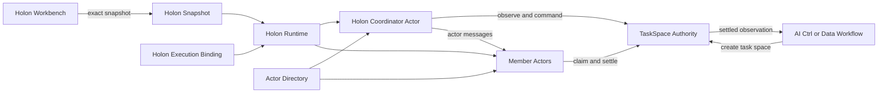
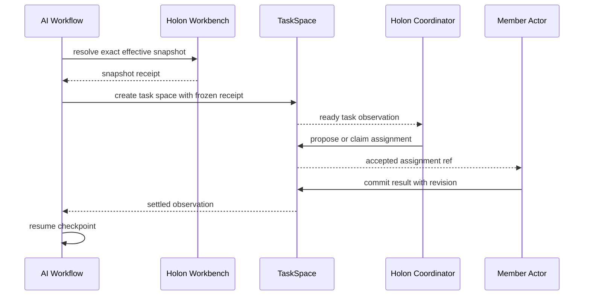
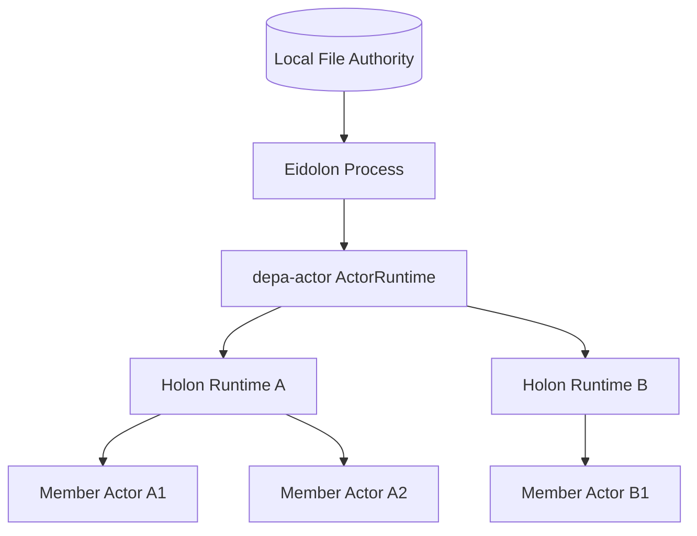
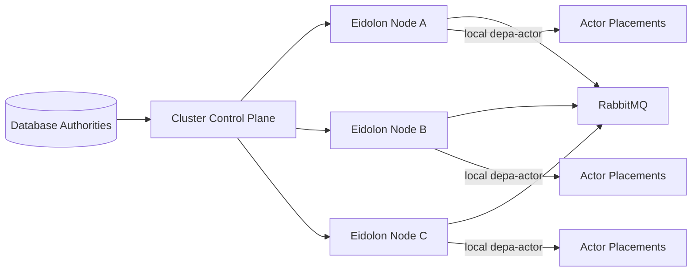

# Holon、TaskSpace 与 Eidolon Actor System 融合架构

## 1. 文档定位

本文固化 Holon Workbench、depa-flows TaskSpace、Eidolon AI workflow 与 actor runtime 的长期融合方向，防止后续规划、上下文压缩或分阶段实现重新混淆已经收敛的边界。

本文是**目标架构与决策总结**，不是当前产品能力说明。文中每项能力均标注为以下三类之一：

- **当前已有**：当前代码中存在可达实现。
- **Mission 1 目标**：本地文件存储、单机多 Holon/Member 运行版本。
- **Mission 2 目标**：数据库存储、基于 depa-actor 与 RabbitMQ 的跨机器版本。

本文不替代 Codument mission/track。Mission 1 的正式 authority 已建立在 `codument/missions/pending/local-file-single-node-holon-task-actor-runtime/`；发生冲突时以 mission decisions、design 和所链接 pending Tracks 为准。

## 2. 已接受的顶层决策

### D1：运行任务冻结组织快照

TaskSpace 创建时冻结 Holon 的 exact effective snapshot。组织之后发生变化，不自动改变运行中的任务；只有显式 replan、revoke 或受控迁移可以改变该任务所依据的组织事实。

### D2：共享 TaskSpace kernel，不强迫领域模型完全相同

人工业务任务和 AI 组织任务共享 TaskSpace 的 identity、forest、transition、revision、CAS、history、persistence 等内核能力，但可以使用不同 profile。Codument 的 TaskSpace DSL 不进入本系统的 runtime 范围；它只是工程 skill 的声明与调度表示。

### D3：Holon Workbench 是组织主数据 authority

Holon Workbench 拥有 Holon、Member、Membership、Role、RoleAssignment、GovernancePolicy 及其 effective-dated change-set 生命周期。

Holon Workbench 的组织逻辑保持人机中立。组织主数据可以记录 Member 的描述性主体性质，例如 `human`、`ai`、`hybrid` 或 `service`，但组织结构、角色、关系和治理算法不按这一分类分叉。

### D4：AgentDefinition 是业务执行扩展

`AIAgentDefinition`、provider、model、prompt、tools、actor/session、endpoint 和 placement 不进入 Holon Workbench 核心模型。App/Eidolon 集成资源将 Holon Member/Role 映射到具体执行载体。

### D5：系统至少拆成两个大 Mission

本需求不能作为一个连续的大 mission 直接实现：

1. **Mission 1：本地文件存储的单机版**，先建立完整 authority、恢复语义与单进程多 Holon/Member E2E。
2. **Mission 2：数据库存储的跨机器版**，在 Mission 1 的稳定契约之上加入集群 placement、RabbitMQ transport、跨节点 supervision 和恢复。

Mission 2 依赖 Mission 1。不得为了提前验证跨机器通信而绕过或复制 Mission 1 建立的 TaskSpace、Holon snapshot、ActorRef 和 persistence contract。

### D6：跨机器 actor 体系建立在 depa-actor 之上

`depa-actor` 是 DEPA 体系中 actor abstraction 的唯一通用 substrate。跨机器版必须在其 `ActorSystem`、typed mailbox、`sendFrom`、`ActorRuntime`、snapshot/recovery 与 fiber orchestration 基础上扩展，不能在 Eidolon 内平行实现另一套 actor 内核。

RabbitMQ 用于 Mission 2 的 MVP transport/broker 验证。RabbitMQ 不拥有组织、任务、actor placement、actor snapshot 或执行结果事实。

### D7：MemberRuntime 默认复用，conversation 默认隔离

同一 deployment 中 `(deploymentId, memberRef)` 默认对应一个长期 MemberRuntime；显式 task-space/workflow-run isolation policy 才创建临时 runtime。长期 runtime 不等于共享 conversation：默认 generic session 按 task claim attempt 隔离，跨调用复用 Agent instance 必须通过 frozen binding 授权的 `{byInstanceId}` 或 `{byInstanceName}` targeted selector。

### D8：MemberPrincipalKind 位于 effective-dated MemberVersion

精确 union 为 `human | ai | hybrid | service | unspecified`。新建必须显式填写，修订产生新有效版本，旧数据只迁移为 `unspecified`；禁止按名称、角色或 prose 推断，也禁止据此自动选择执行 adapter。

### D9：Holon snapshot 与 execution binding 分属两个 authority

Holon Workbench 签发完整 `HolonEffectiveSnapshot` Resource/receipt；闭包包含 OrganizationalSubject、Holon/Version、Member/Version、HolonMembership/Version、Role/Version、RoleAssignment/Version、GovernancePolicy/Version。Eidolon owns `HolonExecutionBinding`（KindDefinition FQN `Eidolon.AI.KindDefinition.HolonExecutionBinding`, `eidolon.ai/v1`, `1.0.0`），通过 closed `ai-agent | human-endpoint | service | hybrid` adapter union扩展组织主数据。

### D10：TaskSpace 共享 kernel、领域 profile 分离

`task-manager-contract` 拥有 closed data/ports，`task-manager-logic` 拥有纯与 runtime-first Processors，`task-manager-file-support` 拥有 Node 文件事务；BP 与 AI organization task 各自拥有 profile，Ctrl/Data 仅做 adapter。Codument TaskSpace 不进入 runtime。

### D11：Mission 1 文件 authority 使用单 owner head-last 协议

各 owner 使用 content-addressed records/trees/receipts、recoverable token/pid/inode lock、CAS、journal、file+exact-parent fsync、head-last admission/readback。跨 owner 只通过 durable receipt + 后续 CAS，不伪造全局文件事务。HolonRuntime/Coordinator 负责组织 assignment，TaskSpace 仍是 assignment/claim/result authority。

## 3. 当前代码事实

### 3.1 Holon Workbench

当前 Holon Workbench 已实现 effective-dated 组织治理模型，包括：

- `Member` / `MemberVersion`
- `Holon` / `HolonVersion`
- `HolonMembership` / `HolonMembershipVersion`
- `Role` / `RoleVersion`
- `RoleAssignment` / `RoleAssignmentVersion`
- `GovernancePolicy` / `GovernancePolicyVersion`
- `HolarchyChangeSet`

当前 `OrganizationalSubjectType` 只区分 `member | holon`，没有 `human | ai` 字段。主体性质若进入组织主数据，需要后续 behavior/contract 变更；不能把当前模型误写为已经支持。

证据入口：

- `holon-workbench.ts/packages/holon-contracts/src/domain.ts`
- `holon-workbench.ts/packages/holon-domain/src/model.ts`
- `holon-workbench.ts/codument/modeling/domain/holon_governance/index.xnl`

### 3.2 Eidolon

当前 Eidolon 已经具有单 VM/进程内的：

- `ActorIdentity.kind = member | holon`
- Member actor 与 Holon actor
- typed mailbox queues
- member roster
- autonomous / leader-led Holon governance
- actor/session snapshot 与恢复
- heartbeat、control signal、child completion
- TaskTree claim 与成员协作
- actor surface 与 lane

证据入口：

- [AiAgentActor.ts](../../../cell/packages/ai-core-contract/src/runtime/AiAgentActor.ts)
- [AiAgentVm.ts](../../../cell/packages/ai-core-contract/src/runtime/AiAgentVm.ts)
- [MemberManager.ts](../../../cell/packages/ai-organ-logic/src/organization/MemberManager.ts)
- [OrganizationManager.ts](../../../cell/packages/ai-organ-logic/src/organization/OrganizationManager.ts)
- [AutonomousHolonTaskRunner.ts](../../../cell/packages/ai-organ-logic/src/organization/AutonomousHolonTaskRunner.ts)

当前限制：

- Member 查找和消息投递绑定当前 VM 内存对象。
- `actor.send()` 直接写本地 mailbox。
- actor key、fiber id、session/VM 具有本地位置含义。
- `TaskTree`、`holonState.tasks` 与 `taskOwnership` 形成多个任务事实面。
- 当前没有集群 ActorRef、placement、lease、remote mailbox 或跨节点恢复协议。

因此当前形态是“单 VM 多 actor”，不是跨机器 actor system。

### 3.3 depa-actor

当前 `depa-actor` 已拥有：

- `ActorSystem`
- actor registration / lifecycle
- `MailboxSchema`
- `ActorEnvelope`
- `ActorRef` / `ActorSelf`
- `sendFrom`
- priority mailbox drain 与 selective receive
- `ActorRuntime` 与 runtime facets/plugins
- snapshot/recovery primitives
- fiber orchestration
- depa-processor dispatch bridge

证据入口：

- `depa-actor/src/core/ActorSystem.ts`
- `depa-actor/src/core/types.ts`
- `depa-actor/src/runtime/ActorRuntime.ts`
- `depa-actor/src/orchestration/`
- `depa-actor/doc/runtime-foundations.md`

当前 `depa-actor` 是本地 actor substrate，尚不提供 RabbitMQ transport 或集群 placement。Mission 2 应在该仓新增通用分布式扩展，再由 Eidolon 组合使用。

## 4. 统一术语

| 概念 | 含义 | Authority |
| --- | --- | --- |
| `HolonDefinition` | 组织主数据中的 Holon、Role、Membership、Policy | Holon Workbench |
| `HolonEffectiveSnapshot` | 某个业务时间点的 exact 组织投影 | Holon Workbench 签发 |
| `HolonRuntime` | 某份组织快照在 Eidolon 中的运行部署 | Eidolon runtime |
| `HolonCoordinatorActor` | 一个 Holon 的运行协调 actor | Eidolon + depa-actor |
| `MemberDefinition` | 组织主数据中的成员身份 | Holon Workbench |
| `MemberRuntime` | 某 Member 在特定 deployment 中的运行实例 | Eidolon runtime |
| `MemberActor` | 执行任务并拥有 mailbox/session 的 actor | Eidolon + depa-actor |
| `TaskSpace` | 任务森林、状态、claim、结果和历史 | task-manager runtime |

必须长期保持：

```text
HolonDefinition != HolonCoordinatorActor
MemberDefinition != MemberActor
```

## 5. 目标 authority map

| 事实 | 唯一 Authority | 其他系统如何使用 |
| --- | --- | --- |
| Holon、Role、Member、Membership、Policy | Holon Workbench | exact snapshot/query |
| Member 主体性质 | Holon Workbench 主数据 | 描述性读取，不决定 actor 实现 |
| 某 TaskSpace 采用的组织版本 | `HolonTaskSnapshotReceipt` | frozen input |
| 任务森林、状态、claim、assignment、result、history | TaskSpace owner | command + observation |
| Member/Role 到执行载体的映射 | `HolonExecutionBinding` | materialize MemberRuntime |
| actor identity、mailbox、session、conversation | Eidolon/depa-actor runtime | ActorRef + message |
| actor placement、node lease、epoch | actor cluster control plane | directory resolve |
| 流程位置、等待点、节点结果、TaskSpaceRef | depa-flows checkpoint | workflow resume |
| Agent 可执行定义 | ResourcePackage 中的 `AIAgentDefinition` | frozen resource closure |

禁止事项：

- Holon Workbench 不写 actor/session/placement。
- Eidolon 不反写组织主数据来表达 actor 在线状态。
- RabbitMQ 不成为任务或 actor 状态 authority。
- workflow checkpoint 不复制完整 TaskSpace 或组织结构。
- `holonState.tasks/taskOwnership` 不再作为独立可写任务真源。

## 6. 目标组件结构



这张图表达 authority 关系，不代表所有组件必须在同一进程或同一存储中。

## 7. HolonExecutionBinding

业务 App 或 Eidolon ResourcePackage 提供独立执行绑定。以下只是目标 shape 的伪代码，最终 schema 必须通过正式 track 冻结：

```ts
type HolonExecutionBinding = {
  holonRef: string
  holonSnapshotRef: string
  holonSnapshotDigest: string
  memberBindings: Array<{
    memberRef: string
    adapter:
      | { kind: "ai-agent"; agentDefinitionRef: string; runtimeProfileRef: string }
      | { kind: "human-endpoint"; humanEndpointRef: string; inboxProfileRef: string }
      | { kind: "service"; serviceAdapterRef: string; runtimeProfileRef: string }
      | { kind: "hybrid"; policyRef: string; candidateBindingRefs: [string, ...string[]] }
  }>
  roleBindings: Array<{
    roleRef: string
    eligibleBindingRefs: string[]
    taskProfileRef?: string
  }>
  governanceRuntimeProfileRef: string
}
```

同一个组织 Member 可以在不同 App 中获得不同业务扩展；Holon Workbench 不感知这些执行绑定。`MemberPrincipalKind` 只描述主数据，不能自动选择或验证 adapter。

## 8. Holon snapshot 与 deployment revision

### 8.1 Deployment revision

`HolonRuntime` 当前采用的组织与执行绑定版本：

```ts
type HolonDeploymentRevision = {
  holonSnapshotDigest: string
  executionBindingDigest: string
  deployedAt: string
}
```

### 8.2 Task snapshot receipt

每个 TaskSpace 创建时冻结：

```ts
type HolonTaskSnapshotReceipt = {
  taskSpaceId: string
  holonRef: string
  effectiveAt: string
  holonSnapshotRef: string
  holonSnapshotDigest: string
  issuerReceiptId: string
  executionBindingDigest: string
  eligibleMemberRefs: string[]
  eligibleRoleRefs: string[]
}
```

组织更新后的规则：

- 新任务可以使用新 deployment revision。
- 已运行任务继续使用创建时 snapshot。
- Member 从组织移除后，不自动从旧任务资格集中消失。
- 强制撤销必须形成显式 replan/revoke transition 和 receipt。
- reconciler 不得静默改写运行中 TaskSpace 的 eligible members。

## 9. TaskSpace 替换 Eidolon 内部任务真源

目标流程：



TaskSpace 是 task status、claim、owner、result 和 history 的唯一 owner。Holon actor 内部只允许保存：

- `TaskSpaceRef`
- subscription cursor
- correlation id
- 可重建 observation cache

不得继续保存一套独立可修改的 task tree/ownership 事实。

## 10. Mission 1：本地文件存储的单机版

### 10.1 目标

在一个 Eidolon 进程中承载多个 HolonRuntime、HolonCoordinatorActor 和 MemberActor，以本地文件作为持久 authority，完成组织快照、TaskSpace、Agent execution 和 workflow recovery 的完整闭环。

### 10.2 物理部署



### 10.3 本地文件 authority

Mission 1 已冻结为按 owner 分区的逻辑布局：

```text
runtime-root/
  organization-authority/
    head.xnl
    records/
    trees/
    receipts/
    transactions/
  holon-deployments/
    <deploymentId>/
      deployment.xnl
      definition/
        holon-snapshot.xnl
        execution-binding.xnl
        resource-closure/
      runtime/
        head.xnl
        records/
        trees/
        receipts/
        transactions/
        registrations/
  instances/
    <instanceId>/
      definition/
      runs/<runId>/
        checkpoint.json
        step-space/
        task-spaces/<taskSpaceId>/
          head.xnl
          records/
          trees/
          receipts/
          history/
          artifacts/
          transactions/
```

这里展示的是 authority 分区，不要求把所有目录都放进同一个 package 或由一个 store 实现。generic actor/session/mailbox/conversation 仍由 Eidolon 既有 owner 存储；deployment 的 `registrations/` 只保留 opaque refs 与 depa-actor registration receipts，绝不复制其物理树。

### 10.4 Mission 1 必须交付

1. Holon Workbench core authority port 与 XNL/file backend。
2. TaskSpace kernel、closed schema、revision/CAS、history、payload/artifact 与文件后端。
3. `HolonEffectiveSnapshot` 与 exact receipt。
4. `HolonExecutionBinding` ResourcePackage contract。
5. 单机 `HolonRuntime` materializer。
6. 复用 depa-actor 的本地 ActorSystem/ActorRuntime。
7. 稳定 logical ActorRef；第一版 resolver 只解析到 local placement。
8. 多 Holon、多 MemberActor 同进程运行。
9. Human/AI/Service/Hybrid MemberRuntime adapter contract，以及 runtime reuse 与 task-attempt/default session isolation 边界。
10. 现有 `holonState.tasks/taskOwnership` 到 TaskSpace projection 的单向迁移。
11. AI Ctrl/Data Workflow 的 Holon target node。
12. 进程重启后的组织快照、TaskSpace、actor/session 与 workflow recovery E2E。

### 10.5 Mission 1 非目标

- RabbitMQ
- 数据库 authority
- 多 Eidolon node
- remote ActorRef
- cluster placement/rebalance
- network partition 与 split-brain
- 完全去中心化 membership

## 11. Mission 2：数据库存储的跨机器版

### 11.1 目标

多个 Eidolon 实例组成 actor cluster。每个进程承载若干来自不同 Holon 的 coordinator/member actor；调用方使用逻辑 ActorRef，业务代码不区分本机和远端。

### 11.2 复用 depa-actor 的扩展边界

建议在 `depa-actor` 项目中增加通用能力，而不是放进 Eidolon 私有实现：

```text
depa-actor
  core ActorSystem and ActorRuntime
  cluster contracts
    ActorAddress
    ActorDirectoryPort
    ActorPlacement
    ActorTransportPort
    ActorEnvelopeCodec
    DeliveryReceipt
  cluster runtime
    local or remote router
    lease and epoch fencing
    supervision hooks
  rabbitmq adapter
    connection and channel runtime
    publish and consume
    confirms and acknowledgements
    dead-letter policy
```

依赖方向：

```text
depa-processor <- depa-actor <- Eidolon AI runtime
                         ^
                         |
             RabbitMQ transport adapter
```

RabbitMQ adapter 可以独立 package 化，但必须实现 depa-actor 的 transport port；不能直接依赖 Eidolon AI workflow、AgentDefinition 或 Holon 语义。

### 11.3 集群结构



推荐 MVP 采用：

```text
数据库/共识支持的集中控制面 + RabbitMQ 数据面
```

第一版不实现完全去中心化 gossip membership。业务 ActorRef API 保持位置透明，以后可以替换 directory 或 transport。

### 11.4 ActorRef 与 placement

业务保存稳定逻辑地址：

```ts
type ActorRef = {
  clusterId: string
  tenantId: string
  actorKind: "holon" | "member" | "workflow" | "agent"
  logicalId: string
}
```

内部 placement：

```ts
type ActorPlacement = {
  actorRef: ActorRef
  nodeId: string
  runtimeId: string
  actorId: string
  epoch: number
  leaseExpiresAt: string
}
```

每个逻辑 actor 同一时刻只有一个 active placement。故障迁移会增加 epoch；旧节点恢复后不能凭旧 epoch 写入 authority。

### 11.5 RabbitMQ MVP topology

推荐采用“按 node 路由、node 内再由 depa-actor 分派”的拓扑，而不是为每个 actor 创建永久 RabbitMQ queue：

- 一个 durable node inbox queue：`eidolon.node.<nodeId>`。
- directory 先把 ActorRef 解析为当前 node placement。
- producer 向目标 node routing key 发布 message envelope。
- node consumer 完成 admission/dedup 后再交给本地 depa-actor `sendFrom`/router。
- placement 变化后由 directory epoch 阻止旧 node 接受新消息或提交结果。
- durable message 使用 persistent delivery、publisher confirm、manual ack 和 dead-letter queue。
- ephemeral signal 可以使用非持久 delivery 或独立短生命周期 channel。

RabbitMQ 只拥有“尚未被目标 mailbox admission 的运输中消息”。一旦 durable mailbox admission 成功，消息恢复 authority 转移给 actor runtime persistence；RabbitMQ ack 随后发生。

### 11.6 Message envelope

目标 envelope 伪代码：

```ts
type ActorMessageEnvelope = {
  schema: "depa.actor-message/v1"
  messageId: string
  sender: ActorRef
  target: ActorRef
  targetEpoch?: number
  correlationId?: string
  causationId?: string
  channel: string
  payloadSchema: string
  payload: unknown
  taskSpaceRef?: string
  deadlineAt?: string
  delivery: "ephemeral" | "durable"
}
```

传输不宣称 exactly-once：

- RabbitMQ/transport 提供 at-least-once delivery。
- mailbox admission 按稳定 `messageId` 去重。
- task/effect 使用 durable idempotency key。
- authority transition 使用 CAS。
- placement 使用 epoch fencing。
- 顺序只在明确的 sender-target-channel 边界内保证，不保证全局顺序。

### 11.7 统一本机与远端调用

底层遵循 DEPA targeted Processor：

```ts
output = fn(runtime, selector, invocation, config)
```

目标 API：

```ts
tellActor(actorRuntime, selector, message, config)
askActor(actorRuntime, selector, request, config)
monitorActor(actorRuntime, selector, config)
```

闭包绑定 facade：

```ts
runtime.actors.tell(selector, message, config)
runtime.actors.ask(selector, request, config)
runtime.actors.monitor(selector, config)
```

local fast path 仍然必须经过同一个 envelope、admission、dedup 和 routing contract；只允许 transport adapter 在解析出 local placement 后省略 RabbitMQ IO。

### 11.8 Mission 2 必须交付

1. depa-actor cluster contracts。
2. depa-actor local/remote unified router。
3. RabbitMQ transport adapter MVP。
4. 数据库-backed organization、TaskSpace、actor snapshots/mailbox 与 placement directory。
5. node registration、heartbeat、lease、epoch fencing。
6. placement supervisor、rebalance 与故障恢复。
7. durable/ephemeral message class。
8. publisher confirms、manual ack、dedup、DLQ 与 retry policy。
9. ActorRef `tell/ask/monitor`。
10. MemberActor/HolonCoordinatorActor 跨节点分布。
11. 节点宕机后的 actor restore 与 TaskSpace claim recovery。
12. AI Ctrl/Data Workflow 跨节点 Holon task E2E。

## 12. HolonCoordinatorActor 职责

HolonCoordinatorActor 不拥有组织结构，也不拥有 TaskSpace。它只拥有运行协调事实：

- deployment revision
- TaskSpace subscriptions
- Member ActorRefs
- routing cursor
- pending correlations
- supervisor state
- runtime health observations

它读取：

- frozen Holon snapshot
- Role/Policy
- HolonExecutionBinding
- TaskSpace ready observations
- Actor Directory placement observations

它只能通过 command 改变 TaskSpace 或 placement authority，不能直接写下游投影。

## 13. MemberRuntime 形态

建议不同主体共享稳定 `MemberRuntimeRef` 和 TaskSpace 协议：

```text
MemberRuntime
  AI      -> AIAgentDefinition-backed MemberActor
  Human   -> HumanEndpointActor or inbox bridge
  Service -> ServiceAdapterActor
  Hybrid  -> policy-selected composite runtime
```

TaskSpace、HolonCoordinatorActor 和 workflow 不按 human/AI 写两套任务协议；差异只由 HolonExecutionBinding 和 runtime adapter 表达。

## 14. 故障与恢复

Mission 1 文件版至少验证：

- candidate/head 原子替换
- revision CAS
- crash journal recovery
- actor snapshot 与 mailbox 恢复
- TaskSpace claim/result recovery
- workflow checkpoint recovery

Mission 2 跨机器版至少验证：

1. node lease 过期；
2. placement supervisor 选择新 node；
3. actor placement epoch 增加；
4. 新 node 恢复 snapshot 和 durable mailbox；
5. 旧 node 被 fencing；
6. pending provider/effect 通过既有 idempotency evidence 收敛；
7. TaskSpace claim 根据 lease/recovery policy 恢复；
8. duplicate RabbitMQ delivery 不产生第二任务结果或第二 provider effect。

位置透明不等于失败透明。调用必须暴露 typed `unavailable`、`moved`、`stale-epoch`、`timeout` 和 `retryable` outcome。

## 15. 与 Erlang 的关系

目标借鉴 Erlang/OTP 的：

- 轻量 actor
- mailbox
- logical actor reference
- location-transparent message send
- supervisor tree
- monitor/link 思想
- process/node failure observation
- 一个 active actor identity
- 节点间直接或 brokered 通信

但 AI runtime 需要额外的 durable business semantics：

- conversation 与 provider call 状态较重；
- LLM effect 可能长时间运行；
- TaskSpace claim/result 必须持久；
- workflow checkpoint 必须可恢复；
- 组织事实是 effective-dated authority；
- network exactly-once 不可假定。

最终目标更准确地描述为：

```text
depa-actor semantics
+ durable TaskSpace authority
+ effective-dated Holon master data
+ RabbitMQ transport
+ AI execution evidence
```

## 16. 不可违背的不变量

1. Holon Workbench 不成为 actor runtime。
2. Eidolon 不成为组织主数据 writer。
3. TaskSpace 是任务事实唯一 owner。
4. depa-actor 是 actor substrate 唯一真源。
5. RabbitMQ 是 transport，不是业务 state store。
6. local 与 remote actor 调用共用一个消息 contract。
7. 每个逻辑 actor 同时最多一个 active placement。
8. TaskSpace 创建后组织 snapshot 不静默漂移。
9. actor/session/conversation 不复制到 flow checkpoint。
10. projection/cache 不反写 authority。
11. Mission 1 不提前引入跨机器旁路。
12. Mission 2 不复制 Mission 1 已建立的 contract 或 store semantics。

## 17. 决策冻结状态

Mission 1 的以下五项原待决策已由 `local-file-single-node-holon-task-actor-runtime` mission decisions 正式冻结，不得在实现中重新临时选择：

1. 一个 Member 在一个 deployment 中默认复用一个长期 MemberRuntime；只有 closed explicit isolation 才创建临时实例，conversation 默认按 task claim attempt 隔离。
2. `MemberPrincipalKind` 精确为 `human|ai|hybrid|service|unspecified`，位于 effective-dated `MemberVersion`，旧数据迁移为 `unspecified`。
3. `HolonExecutionBinding` 的 Kind/FQN/apiVersion/KindDefinition version 与 ai-organ package authority，以及 closed execution adapter union。
4. TaskSpace kernel、领域 profile 与 `task-manager-file-support` package 边界；Codument TaskSpace 排除。
5. Mission 1 各 owner 的 records/trees/receipts/transactions、recoverable lock、CAS、fsync、head-last 与跨 owner receipt handoff。

Mission 2 仍需在其正式 mission 中冻结：

1. 数据库选择及各 authority 的 schema ownership。
2. depa-actor cluster packages 的精确拆分。
3. RabbitMQ exchange/queue/routing/dead-letter 的 exact contract。
4. `ask` 的 durable future/receipt 语义。
5. supervisor hierarchy、placement constraints 和 capacity model。
6. HumanEndpointActor 的认证、授权和离线 inbox 语义。

## 18. 规划路由

本架构应使用两个串行大 mission，而不是一个超长 mission：

```text
Mission 1: local-file-single-node-holon-task-actor-runtime
    Holon file authority
    TaskSpace runtime
    ExecutionBinding
    single-node depa-actor integration
    workflow E2E and recovery

        then

Mission 2: database-rabbitmq-distributed-holon-actor-cluster
    depa-actor cluster extension
    RabbitMQ transport MVP
    database authorities
    placement and supervision
    cross-node workflow E2E and failure recovery
```

每个 mission 内部仍需拆成多个 track，并在执行中依据验证证据重规划。Mission 1 的 public contracts 和恢复行为验收通过之前，不应启动 Mission 2 的产品接线。
